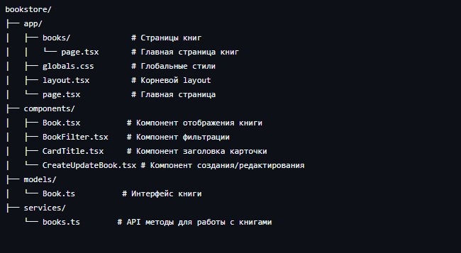
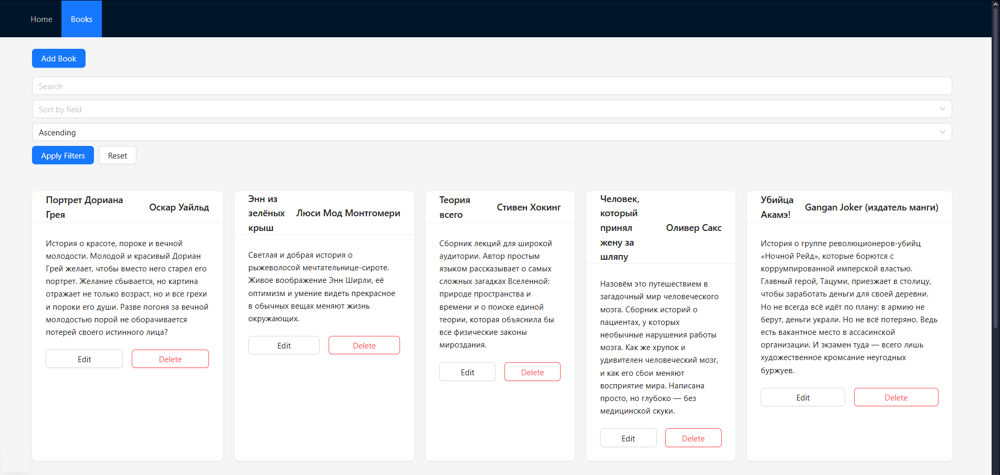
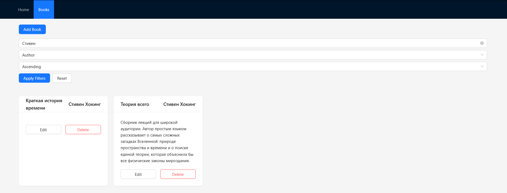

# bookstore

Frontend приложение для управления книгами, разработанное на Next.js с TypeScript и Ant Design.

## Структура

## Использование

Приложение работает с бэкенд API: https://github.com/NikitosII/BookStore.API.git
